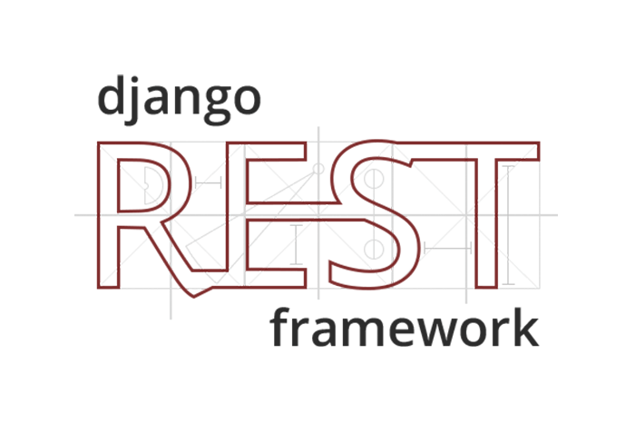

# DRF Blog Api With Otp Authentication



This project is a Blog site written with **python3.9** and **Django3.2** and **Django_rest_framework_3.12** which is for using api.

The purpose of this project was to see how a blog with **otp** authentication can be implemented using the django-rest-framework.

## Features

- Authentication with phone number and **Otp** code.
- Send otp code to user's phone.
- Two-step verification for authentication.
- Use cache to temporarily store otp code.
- Generate tokens using **simple-jwt** after authentication.
- Production-ready configuration for Static Files, Database Settings, Gunicorn, Ngnix, Docker.
- Easy installation.
- Automatically delete photos after deleting the blog.
- Ability to comment on blogs.
- Use the PostgreSQL database to store data.


## Technologies used

- [Python 3.9](https://www.python.org/) , Programming Language. [](https://img.shields.io/badge/python-3.9-red)
- [Django 3.2](https://docs.djangoproject.com/en/3.2/releases/3.2/) ,  Web Framework.
- [Django Rest Framework 3.12](https://www.django-rest-framework.org/) , Web API's.
- [Nginx](https://www.nginx.com/) , Web Server.
- [Docker](https://www.docker.com/) , Container Platform.
- [PostgreSQL](https://www.postgresql.org/) , Database.
- [Gunicorn](https://gunicorn.org/) , WSGI HTTP Server.
- [Git](https://git-scm.com/doc) , VCS(Version Control System).


## Requirements

**install Docker**

To run this project, you must install Docker and docker-compose.

- [install Docker in Linux](https://docs.docker.com/engine/install/)
- [install Docker in Windows](https://docs.docker.com/desktop/windows/install/)
- [install Docker in Mac](https://docs.docker.com/desktop/mac/install/)

and also install docker-compose.

- [install docker-compose](https://docs.docker.com/compose/install/)


## Installation

**Clone the project**

```shell
git clone https://github.com/amirpsd/drf_blog_api.git && cd drf_blog_api && cp .env-sample .env && cp .env.db-example .env.db && rm .env-sample .env.db-example
```


Please enter the required information in the **.env** and **.env.db** files before running the project.


**Run project**

**create docker network**

```shell
docker network create nginx_network
docker network create blog_network
```

**create docker volume**

```shell
docker volume create db_data
```

**run project**

```shell
docker-compose up -d
```

You currently have 3 containers running:

- web
- nginx 
- db

Now create a super user with a **web** container to access the Django admin panel.

```shell
docker exec -it web python3 manage.py createsuperuser
```

After creating a super user, go to http://127.0.0.1:80/account/api/login/.

And after authentication, create the super user two-step password. http://127.0.0.1:80/account/api/create-two-step-password/

Finally, go to the admin panel. http://127.0.0.1:80/admin/


## Endpoints

You can see the [endpoints.yaml](https://github.com/amirpsd/drf_blog_api/blob/main/endpoints.yaml) file to see the exact details of the endpoints.

or you can go to http://127.0.0.1:80/api/schema/swagger-ui/ or http://127.0.0.1:80/api/schema/redoc/
to see the endpoints after running the project.


## LICENSE

see the [LICENSE](https://github.com/amirpsd/drf_blog_api/blob/main/LICENSE) file for details.
